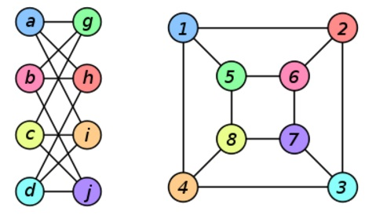

1. Define:

	(a) Subgraph: é um subconjunto de uma gráfico, quando você quer analizar apenas uma parte do gráfico.
	
	(b) Bipartite graph: é quando um gráfico há dois conjuntos, em que os itens do primeiro só tem ligação com os itens do segundo e vice-versa. 
	
	(c) Hamiltonian graph: é quando em um gráfico há apenas um caminho para o node seguinte e pode-se voltar para o primeiro node apenas depois de passar por todos os nós.  
	
	(d) Eulerian graph: é quando em um gráfico há a possibilidade de passar por todos os caminhos uma unica vez e voltar para o node inicial.

2. Describe how a breadth-first search algorithm works: O algoritmo consiste em visitar todos os nós de um grafos apenas uma vez, passando por todos os elementos do grafo, basicamente ele vai da raiz as estremidades, armazenando os nós já visitados.

3. How many edges does a complete graph with n vertices have? What about a complete directed graph with n vertices? Um grafo completo com n vértices possui (n*(n-1))/2 arestas. Isso ocorre porque cada vértice está conectado a todos os outros vértices por uma aresta, mas só precisamos contar cada aresta uma vez (então dividimos por 2). O direto é apenas n* (n-1).

4. What are isomorphic graphs? Draw an example: Um grafico isometrico é quando temos dois graficos que podem ter uma função para formar um outro, ou ter um arranjo diferente, isso é bom para que possamos analizar um grafico com base em outro com as mesmas caracteristicas.

5. Calculate the degree of the nodes for both node types in the bipartite adjacency matrix from the figure below. Find the isolated node(s).

A resposta esá no colab: https://colab.research.google.com/drive/1O_uq-y4ue1dy1LYN1NTrxT9TTskN-cJD?usp=sharing

6. Given the digraph `G = (V, E)` where `V = {M, N, O, P, Q, R, S}` and 

`E ={(M, S), (N, O), (P, R), (N, S), (O, M),
	 (N, Q), (O, M), (P, P), (S, M), (O, N), 
	 (S, M), (N, R), (P, M), (M, S)}`

	

	(a) Specify, if any, a simple path from vertex M to vertex S. sim tem um caminho simples (M -> S)

	(b) Specify, if any, a simple cycle, involving at least 4 nodes. tem o circulo: (N -> O -> M -> S -> N).

	(c) Is the digraph connected or not connected? Não, não há caminhos de P para N, Q, R, ou S

	(d) What is the degree of vertices N and R. N = 2, R = 2

	(e) Represent the digraph using adjacency list representation.
	
	{
    'M': ['S'],
    'N': ['O', 'Q', 'S', 'R'],
    'O': ['M', 'N'],
    'P': ['R', 'M'],
    'Q': [],
    'R': ['M'],
    'S': ['M']
}

	(f) Represent the digraph using adjacency matrix representation.
	

7. Draw the undirected and directed versions of the graph G(V, E), where V = {1, 2, 3, 4, 5, 6} and E = {(2, 5), (6, 1), (5, 3), (2, 3)}.

8. How many edges does a graph have 3 vertices of degree 3 and one vertex of degree 5?
A soma dos graus de todos os vértices em um grafo não direcionado é igual a duas vezes o número de arestas. Então, vamos primeiro encontrar a soma dos graus de todos os vértices neste grafo:

Soma dos graus = (3 x 3) + 5 = 14

Como existem 4 vértices, o grafo tem um total de 7 arestas (14/2 = 7).

Portanto, o grafo tem 7 arestas.

9. Mr. A is friend with Mrs. B, but she doesn't like him back. She has a reciprocal friendship with both C and D, but only C considers D a friend. D has also sent friend requests to E, F, G, and H but, so far, only G replied. G also has a reciprocal relationship with A. Draw the corresponding directed graph.

10. Draw the graph from the previous exercise as undirected and weighted, with the weight being 2 if the connection is reciprocal, 1 otherwise.

